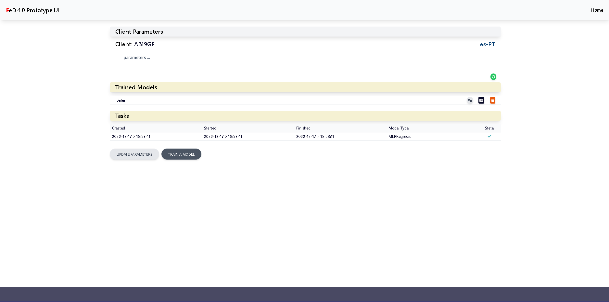

# Frontend created using [React](https://reactjs.org)



This project was bootstrapped with [Create React App](https://github.com/facebook/create-react-app).

## Setting up the project

Needs [NodeJS](https://nodejs.org/en/) installed.

In the project directory `/client_web_ui`, run:

```bash
npm start
```

this runs the app in development mode.

Open [http://localhost:3000](http://localhost:3000) to view the app in a browser.

**Notes**:

 - The app reloads when new changes are detected.
 - lint errors are shown in the console.

 - If you get the error: `react-scripts is not recognized as an internal or external command ...`, run:

```bash
npm install
```

Then run:

```bash
npm start
```

There may be some messages in the console:

```bash
O:\frontend\client_web_ui>npm install
npm WARN EBADENGINE Unsupported engine {
npm WARN EBADENGINE   package: '@react-ui-org/react-ui@0.50.1',
npm WARN EBADENGINE   required: { node: '>=16.14.0 <17', npm: '>=8.3.0' },
npm WARN EBADENGINE   current: { node: 'v18.12.1', npm: '8.19.2' }
npm WARN EBADENGINE }

added 1561 packages, and audited 1562 packages in 46s

239 packages are looking for funding
  run `npm fund` for details

6 high severity vulnerabilities

To address all issues (including breaking changes), run:
  npm audit fix --force

Run `npm audit` for details.
npm notice
npm notice New major version of npm available! 8.19.2 -> 9.2.0
npm notice Changelog: https://github.com/npm/cli/releases/tag/v9.2.0
npm notice Run npm install -g npm@9.2.0 to update!
npm notice
```

Ignore them for the time being.

```bash
npm test
```

launches the test runner in interactive watch mode.

 - Read [running tests](https://facebook.github.io/create-react-app/docs/running-tests) for more information.

```bash
npm run build
```

builds the app for production to the `build` folder.

**Notes**:

 - This correctly bundles React in production mode and optimizes the build for the best performance.
 - The build is minified and the filenames include the hashes.
 - The app is ready for deployment!

 - Read [deployment](https://facebook.github.io/create-react-app/docs/deployment) for more information.

```bash
npm run eject
```

**Note: this is a one-way operation. Once you `eject`, you can't go back!**

If you aren't satisfied with the build tool and configuration choices, you can `eject` at any time. This command will remove the single build dependency from your project.

Instead, it will copy all the configuration files and the transitive dependencies (webpack, Babel, ESLint, etc) right into your project so you have full control over them. All of the commands except `eject` will still work, but they will point to the copied scripts so you can tweak them. At this point you're on your own.

You don't have to use `eject`. The curated feature set is suitable for small and middle deployments, and you shouldn't feel obligated to use this feature. However we understand that this tool wouldn't be useful if you couldn't customize it when you are ready for it.

## Learn More

You can learn more in the [Create React App documentation](https://facebook.github.io/create-react-app/docs/getting-started).

To learn React, check out the [React documentation](https://reactjs.org/).

### Making a Web App

[Read](https://facebook.github.io/create-react-app/docs/making-a-progressive-web-app)

### Advanced Configuration

[Read](https://facebook.github.io/create-react-app/docs/advanced-configuration)

### Deployment

[Read](https://facebook.github.io/create-react-app/docs/deployment)

### `npm run build` fails to minify

[Read](https://facebook.github.io/create-react-app/docs/troubleshooting#npm-run-build-fails-to-minify)
